# Causal_discovery-Experiment  
  
The idea is to use deep learning to directly estimate g and f in the post-nonlinear model in an attempt to perform nonlinear causal search. However, we impose a constraint to maximize the independence between residuals.  
The calculation assumes the existence of an unobserved common cause $`\mu`$.
This is not practical at all because the computation time exceeds the acceptable limit.

 **post-nonlinear model**  
 $` y=g^{-1} (f(x) + \epsilon ) `$
  
We are experimenting with a similar model of post-nonlinear model.  
 $` y=g^{-1} (f(x, \,\,\boldsymbol{\mu}) + \epsilon ) `$  
$` \mu `$ is a generalized Gaussian distribution $`\,`$  
$` \mu(x) = \frac{\beta^{1/2}}{2\Gamma(1+1/\rho)} exp(-\beta^{1/2}|x-\tilde{x}|^{\rho})`$  

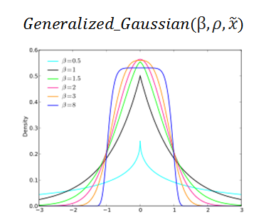  

$`\beta`$ and $`\rho`$ are parameters to be determined and estimated by optimization.  

 $` loss = max(w1 \,max(e_{i}), w2\,max(MI(e_{i},e_{j})))+\epsilon\,(w1 \,max(e_{i}), w2\,max(MI(e_{i},e_{j})))`$

MI is an independent variable if it is zero in the mutual information content.   
In other words, $`\mu`$ is obtained so that both the residuals and
 the mutual information content between residuals are minimized.   
 Loss loss is an expanded Tchebyshev scalarization function.  

- $`\epsilon`$=0.0001
- $`w1`$=0.7
- $`w2`$=0.4

---
## Experiment
- Causal structure compared  
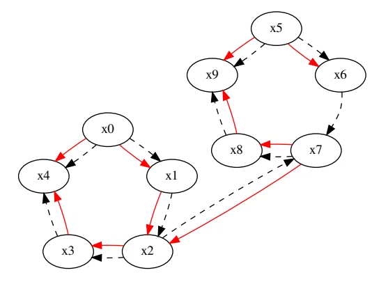  
reference https://proceedings.mlr.press/v177/uemura22a/uemura22a.pdf   

Solid and dashed lines are estimated edges and ground truths, respectively.

- ICA-LiNGAM  
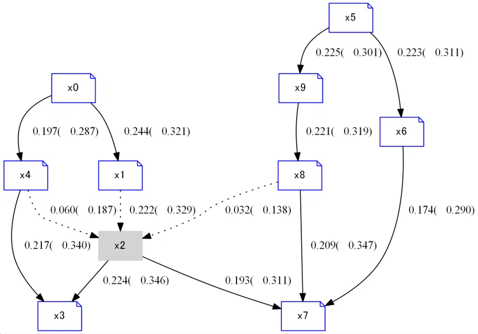 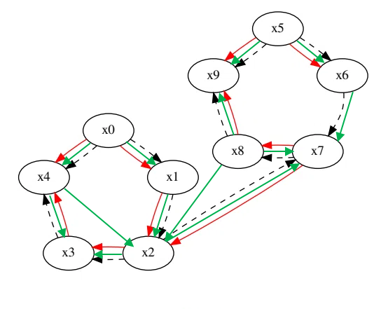    
   

The numbers mean the correlation coefficient in parentheses and the linear coefficient outside the parentheses.  
The green arrow line is the result of ICA-LiNGAM  

- Experiment  

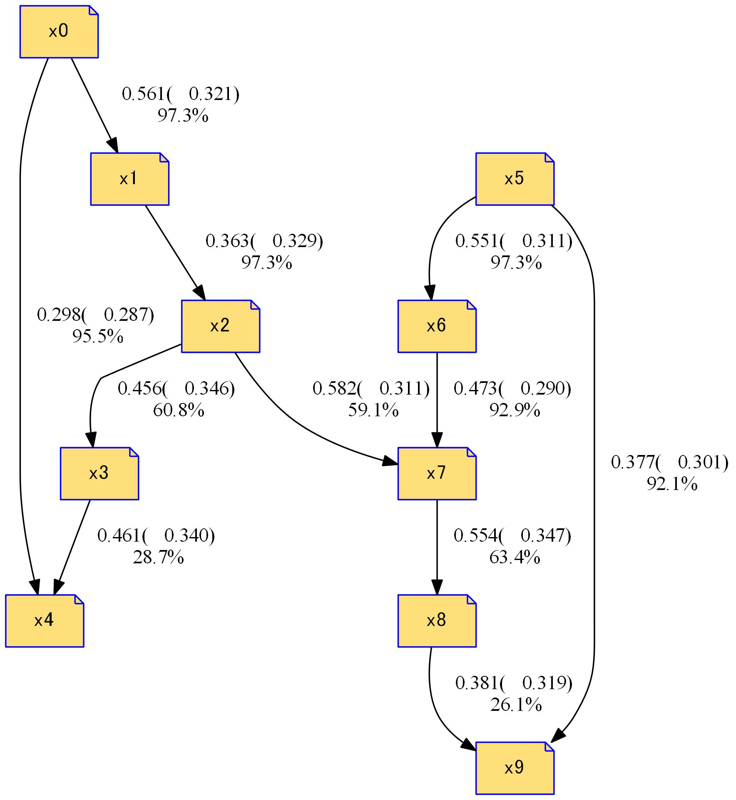 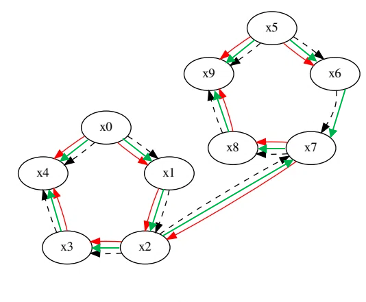    
    

The values in parentheses indicate the correlation coefficient, the values outside the parentheses indicate the feature importance, and the percentage values indicate the confidence level.
Feature Importance is a relative value when the maximum is 1.0.  
The green arrow line is the result of the experiment  

- Causal structure compared  
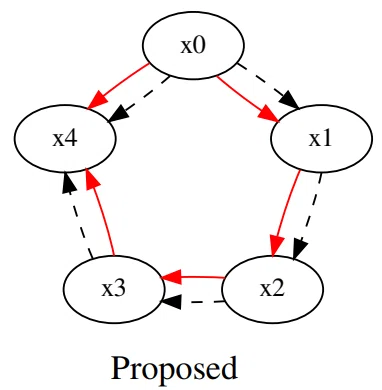  
reference https://proceedings.mlr.press/v177/uemura22a/uemura22a.pdf   

Solid and dashed lines are estimated edges and ground truths, respectively.  

- ICA-LiNGAM  
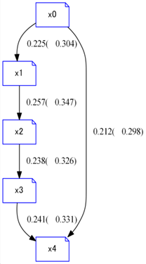  

- Experiment  
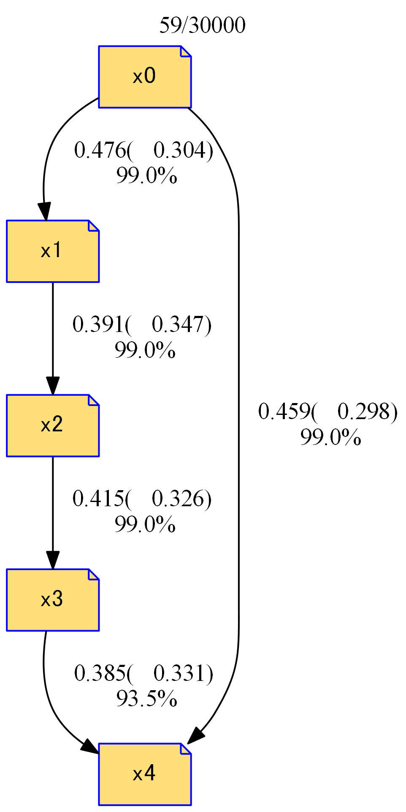  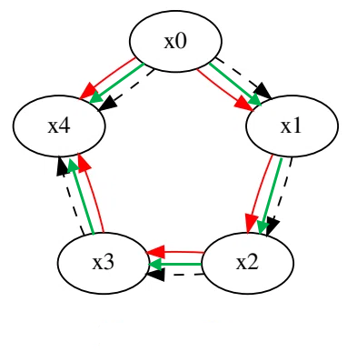    
The values in parentheses indicate the correlation coefficient, the values outside the parentheses indicate the feature importance, and the percentage values indicate the confidence level.
Feature Importance is a relative value when the maximum is 1.0.  
The green arrow line is the result of the experiment  
      

---
## Probability of possible causality from each variable  
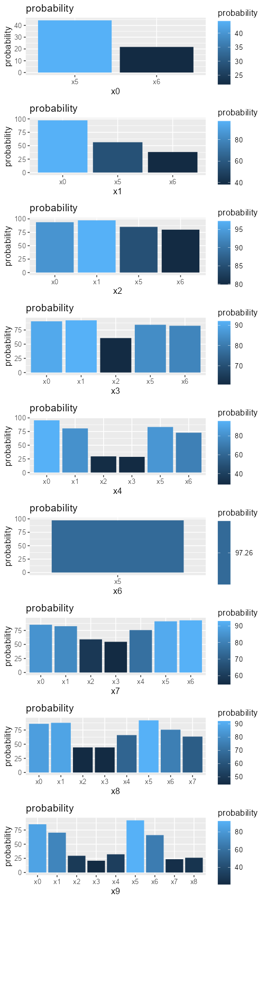  

## Examples of output other than causal structure  
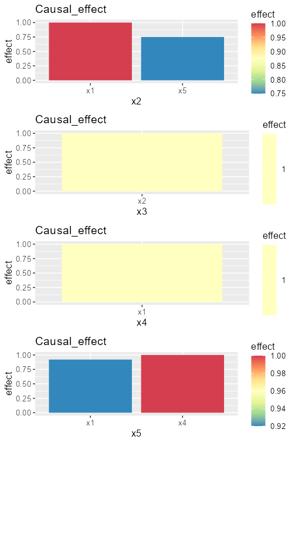  

## Error for each variable in the causal structure model  
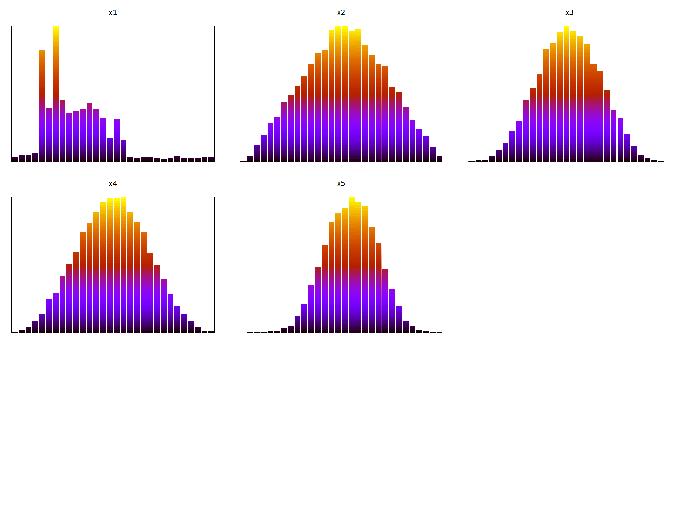  

---
## Estimate contributions from unobserved variables  
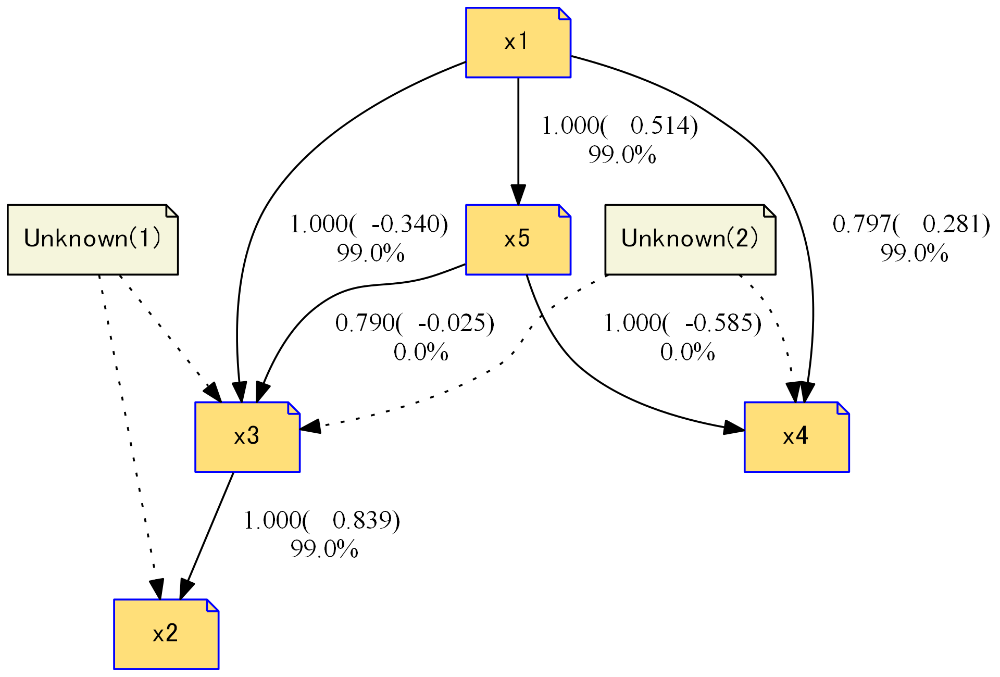  

---


---
## Note  
This is still an experimental implementation.
Therefore, the optimization is close to a parameter brute force approach,   
where randomly generated parameters are set and computed, and the optimal solution is updated as the LOSS becomes smaller.   
Therefore, it is very difficult to determine at what point to stop the calculation.  

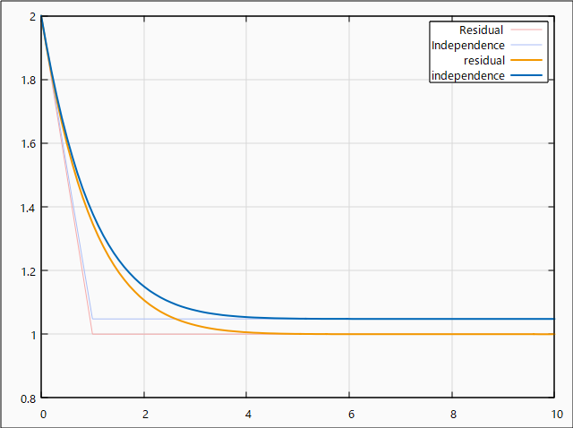  
In this example, it took 59 iterations to obtain the correct result, which I believe is very rare.
This is a very fortunate case.
In other experiments, it has often occurred that 20,000 calculations are required.  

The causal structure is correct when the LOSS drops the most, even though it may change only slightly.  

- loss  1->2->3->4  
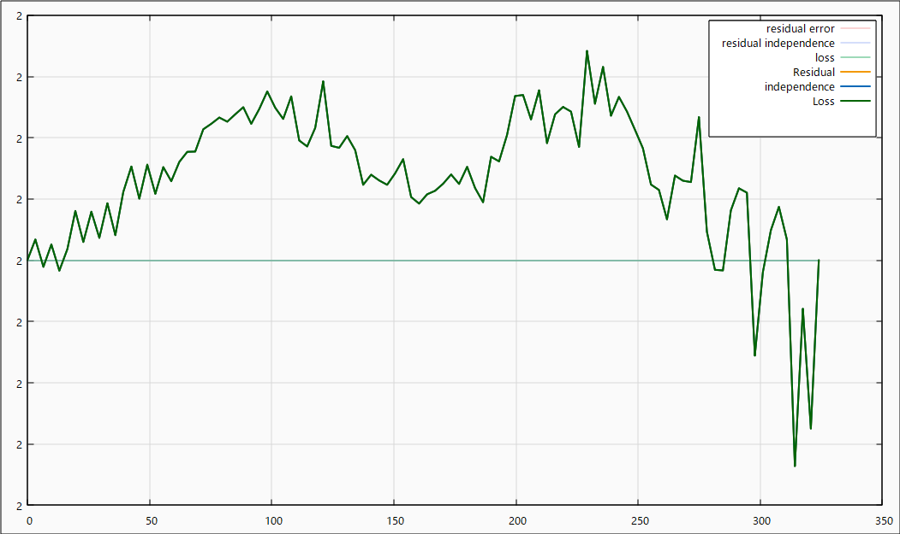  

- 1  
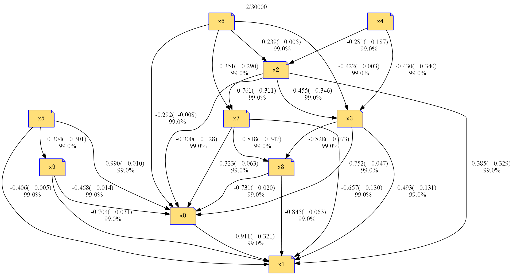  

- 2  
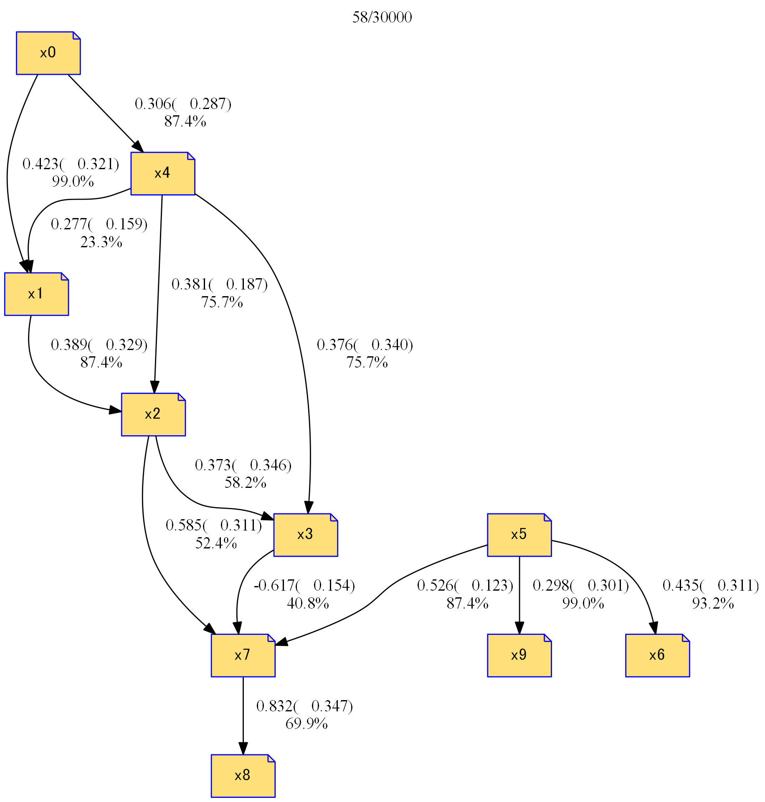  

- 3  
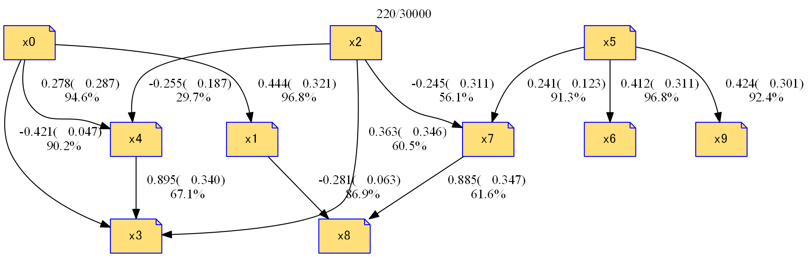  

- 4   
  

---
Roughly speaking, ICA-LiNGAM is used. However, LiNGAM is used to obtain the B matrix, so it does not have to be LiNGAM.  
The B matrix is used as a causal (parent-child) structure and ignored for their linear relationship.  
Adding fluctuations to the input data changes the causal structure (B matrix) that is computed and calculated.  
In other words, different causal (parent-child) structures are obtained.

In the case of ICA-LiNGAM, it is a linear model, so it is as follows.  

```math
\begin{pmatrix}
x_{1} \\
x_{2} \\
 \vdots \\
x_{n} \\
\end{pmatrix} = \begin{pmatrix}
0 & 0 & \cdots & 0 \\
B_{21} & 0 & \cdots & 0 \\
 \vdots & \vdots & \cdots & \vdots \\
B_{n1} & B_{n2} & \cdots & 0 \\
\end{pmatrix}\begin{pmatrix}
x_{1} \\
x_{2} \\
 \vdots \\
x_{n} \\
\end{pmatrix} + \begin{pmatrix}
\epsilon_{1} \\
\epsilon_{2} \\
 \vdots \\
\epsilon_{n} \\
\end{pmatrix}
```

$`x_{1} = \epsilon_{1}`$  
$`x_{2} = {B_{21}\,x}_{1} + \epsilon_{2}`$  
$`x_{3} = {B_{31}\,x}_{1} + {B_{32}\,x}_{2} + \epsilon_{3}`$  
$`x_{4} = {B_{41}\,x}_{1} + {B_{42}\,x}_{2}  + {B_{43}\,x}_{3}+ \epsilon_{4}`$  
$`\cdots `$  

$`x^{\prime} \leftarrow x - (distribution\_rate* normal\_distribution\_random() + \mu(x)\_random()\,distribution\_rate)`$
  
Based on the causal relationship (parent-child relationship) based on the structure of this B matrix  
$`x \rightarrow y`$   
relationship can be obtained.   

$`x_{1} = \epsilon_{1}`$  
$`x_{2} = (g^{-1}f)_{1}(x_{1},\,\,\, \mu_{1}\,u1\_param)`$  
$`x_{3} = (g^{-1}f)_{2}(x_{1}, x_{2},\,\,\,\mu_{1}\,u1\_param,\mu_{2}\,u1\_param)`$  
$`x_{4} = (g^{-1}f)_{3}(x_{1}, x_{2}, x_{3},\,\,\,\mu_{1}\,u1\_param,\mu_{2}\,u1\_param,\mu_{3}\,u1\_param)`$  
$`\cdots `$  

$`u1\_param`$  is used for scale adjustment.   

<!-- 
$`y=g^{-1}f(x, \mu)`$  
and   
$`g(y) = f(x, \mu) `$   
is estimated by deep learning.
In other words, the optimization is performed so that   
$`\|(y_{pred} - y_{obs})\|`$   
is minimized, but   
$`\|g(y_{pred}) - y_{obs}\|`$   
must also be minimized. 
In addition, adjust the undetermined parameters so that the loss is minimized.  
$` loss = max(w1 \,max(e_{i}), w2\,max(MI(e_{i},e_{j})))+\epsilon\,(w1 \,max(e_{i}), w2\,max(MI(e_{i},e_{j})))`$  
-->  

$`f`$ and $`g`$ are trained as follows using deep learning.  
I understand this is pretty redundant.  
$`output = F(x)`$

$`output2 = G(y)`$  
Train output2 to be the same value as output  
$`|output2 - output| \rightarrow 0  \rightarrow G(y)  = F(x)`$  

$`output3 = H(output)`$  
Train output3 to be the same value as output at the same time  
$`|output - output3| \rightarrow 0 \rightarrow y  = H(F(x))`$  

By training F, G, and H at the same time  
$`F(x) = f(x)\rightarrow f=F`$,  
$`F(x) = G(y)\rightarrow g=G`$,  
$`H( G(y)) = y \rightarrow H=G^{-1}\rightarrow g^{-1} = G^{-1}`$    
can be obtained.

In the above, we have
$`y = g^{-1}(f(x)+ε)`$
can be obtained.  

Further, the parameters are updated so that LOSS is minimized.  
$` loss = max(w1 \,max(e_{i}), w2\,max(MI(e_{i},e_{j})))+\epsilon\,(w1 \,max(e_{i}), w2\,max(MI(e_{i},e_{j})))`$  

---

## dataset
- **fMRI_sim1.csv , fMRI_sim2.csv**  
fMRI simulation data 
https://www.fmrib.ox.ac.uk/datasets/netsim/index.html
(Smith et al., 2011).   

- fMRI_sim1  
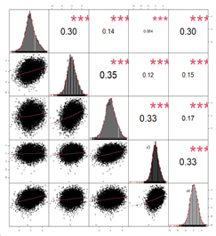  

- fMRI_sim2  
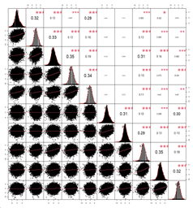  


--- 
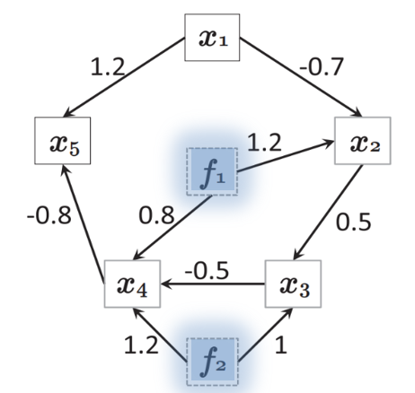   

- **LiNGAM_latest3.csv**  
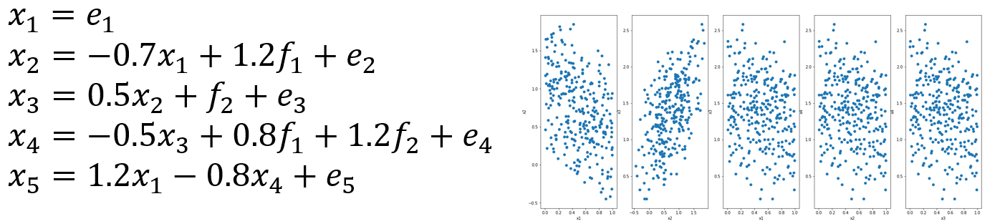  

- **nonlinear_LiNGAM_latest3a.csv**  
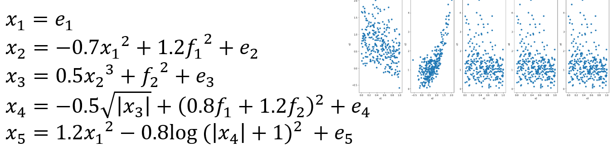  
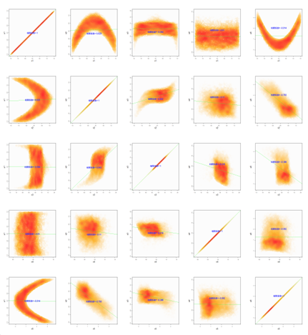  

- **nonlinear_LiNGAM_latest3b.csv**  
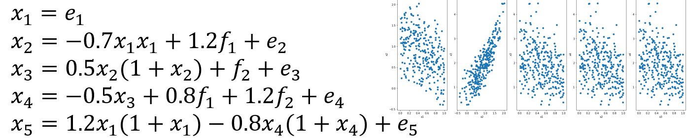  
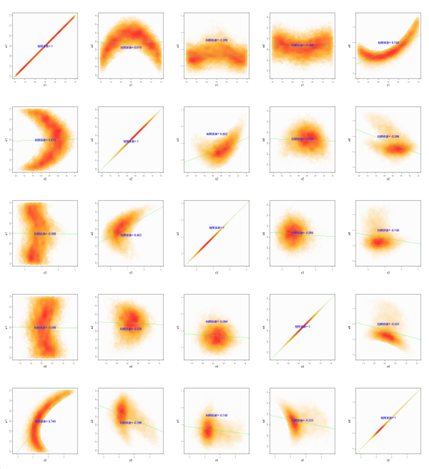  

---    
- **nonlinear_LiNGAM_latest3c.csv**  
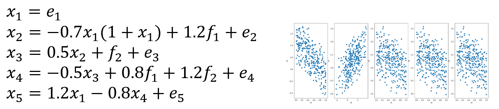  
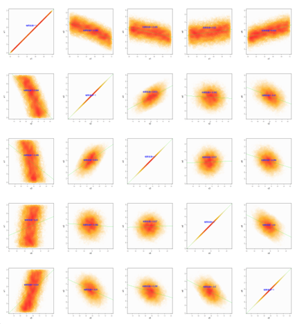  

- **nonlinear.csv**  
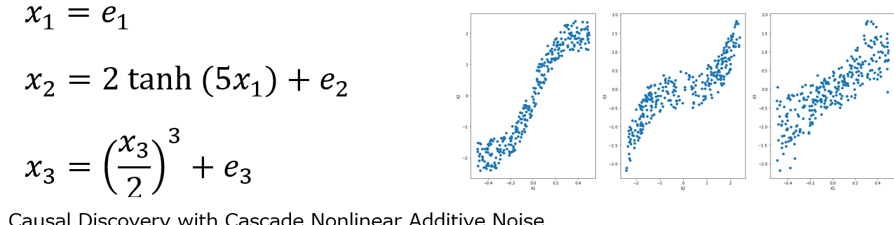  

- **nonlinear2.csv**  
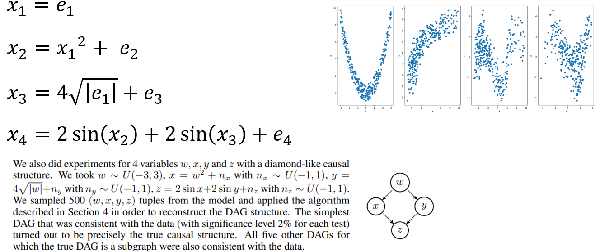  
[Nonlinear causal discovery with additive noise models](https://proceedings.neurips.cc/paper_files/paper/2008/file/f7664060cc52bc6f3d620bcedc94a4b6-Paper.pdf)

---

## method ICA-LiNGAM  
| data |  Direction reversal|Direction missing|Wasted Edge|  
|---------------------|-------------|----------| ---------|
|fMRI_sim1| 0|0|0|
|fMRI_sim2|2|0|2|
|LiNGAM_latest3|0|2|0|
|nonlinear_LiNGAM_latest3a|0|3|0|
|nonlinear_LiNGAM_latest3b|1|2|1|
|nonlinear_LiNGAM_latest3c|1|0|0|
|nonlinear|1|0|1|
|nonlinear2|0|3|0|

---
## Experiment  
| data |  Direction reversal|Direction missing|Wasted Edge|   
|---------------------|-------------|----------|  ---------|
|fMRI_sim1| 0|0|0|
|fMRI_sim2|0|0|0|
|LiNGAM_latest3|0|0|3|
|nonlinear_LiNGAM_latest3a|0|0|3|
|nonlinear_LiNGAM_latest3b|0|0|5|
|nonlinear_LiNGAM_latest3c|0|0|5|
|nonlinear|0|0|3|
|nonlinear2|0|0|3|


A wasted edge is an edge that could not be deleted because deleting that edge would cause other valid edges to disappear.  

---

---
## requirements
- [pytorch(libtorch) > 2.5.0](https://pytorch.org/)
- [ >= R-4.2.3](https://www.r-project.org/)
- [gnuplot](http://www.gnuplot.info/)
- [Graphviz](http://www.graphviz.org/)
- [Rtools](https://cran.r-project.org/bin/windows/Rtools/history.html)  
※Rtools must match R version  

## Modifications required to run in your environment  
Please modify the init.bat according to the installation location and version of R.  
Describe the bus where **gnuplot** is installed in ``Causal_Search_Experiment/bin/gnuplot_path.txt``  
Describe the bus where **graphviz** is installed in ``Causal_Search_Experiment/bin/graphviz_path.txt``


## build  
When installed, the pre-built binary files are also automatically placed in bin.  
To rebuild it yourself, simply rebuild the following and overwrite bin with the generated binaries  

[Statistical_analysis](https://github.com/Sanaxen/Statistical_analysis)  
https://github.com/Sanaxen/Statistical_analysis/tree/master/example/LiNGAM  
build :**Release_pytorch** binary:**LiNGAM_cuda.exe**

[cpp_torch](https://github.com/Sanaxen/cpp_torch)  
buld : project **rnn6** binary:**rnn6.dll**

---  


<!--
## command line option
Command_Line_Options.md  
[command line option](https://github.com/Sanaxen/Causal_discovery-Experiment/blob/main/Command_Line_Options.md)
-->


# Command Line Options

| Command Line Option | Description | Argument | Number of Arguments | Details | Default |
|---------------------|-------------|----------|---------------------|---------|---------|
|  | --csv | CSV file name | 1 | Mandatory |  |
|  | --header | 0 or 1 | 0-1 | If a header (column name) exists, set to 1 | 0 |
|  | --col | Number | 0-1 | Number of columns to skip (starting from the first column) | 0 |
|  | --iter | Number | 0-1 | Maximum iterations for convergence in independent component analysis | 1000000 |
|  | --lasso | LASSO parameter | 0-1 | Prune edges using LASSO regularization (LASSO parameter) | 0 |
|  | --sideways | 0 or 1 | 0-1 | Set to 1 for a horizontal diagram | 0 |
|  | --output_diaglam_type | File extension | 0-1 | File extension for diagram output | png |
|  | --diaglam_size | Number | 0-1 | Scaling factor for diagram output size | 20 |
|  | --x_var | Column name | Variable | Explanatory variable column name or index |  |
|  | --y_var | Column name | Variable | Target variable column name or index |  |
|  | --error_distr | 0 or 1 | 0-1 | Set to 1 to perform residual analysis and output error_distr.csv | 1 |
|  | --error_distr_size | Number,Number | 0-1 | Size (scaling factor) for residual analysis result images (height and width) | 1,1 |
|  | --min_cor_delete | Value > 0 | 0-1 | Remove relationships with correlation (absolute value) below this value | -1 |
|  | --min_delete | Value > 0 | 0-1 | Remove relationships with causal effects (absolute value) below this value | -1 |
|  | --cor_range_d | Value > 0 | 0-1 | Lower bound of correlation range for relationship output | 0 |
|  | --cor_range_u | Value > 0 | 0-1 | Upper bound of correlation range for relationship output | 0 |
|  | --ignore_constant_value_columns | 0 or 1 | 0-1 | Set to 1 to ignore columns with constant values | 0 |
|  | --lasso_tol | Value | 0-1 | Convergence threshold for LASSO pruning | 0.0001 |
|  | --lasso_itr_max | Number | 0-1 | Maximum iterations for LASSO pruning convergence | 10000 |
|  | --load_model | Model file name | Optional | Reevaluate using precomputed data without causal search calculations |  |
|Experiment  | --prior_knowledge | Prior knowledge data | Optional | Specify prior causal knowledge |  |
|Experiment  | --prior_knowledge_rate | 1 ≥ Value > 0 | 0-1 | Accuracy of prior causal knowledge | 1 |
|  | --pause | 0 or 1 | 0-1 | Prevent console from closing after execution by setting to 1 | 0 |
|  | --normalize_type | 0, 1, or 2 | 0-1 | Normalize (1), standardize (2), or keep data as is (0) | 0 |
|  | --min_delete_srt | Number | 0-1 | Remove variables with causal effects smaller than the specified number of top variables | 0 |
|  | --use_adaptive_lasso | 0 or 1 | 0-1 | Use adaptive LASSO for variable selection in LASSO | 1 |
|  | --R_cmd_path |R path |Optional |  "R path" CMD BATCH --slave --vanilla  script.r |  |
|  | --layout | graphviz layout option |  dot,circo,osage,sfdp,twopi | dot |
|Experiment  | --independent_variable_skip | 0 or 1  |  0-1 | 0 |
|Experiment  | --unique_check_rate | 0 or 1  | Number of unique elements  > all size*unique_check_rate -> category| 0.1 |
|||||||
|Experiment  unmeasured confounder  | --confounding_factors | 0 or 1 | 0-1 | Set to 1 for latent common variable calculations | 0 |
|Experiment unmeasured confounder  | --mutual_information_cut | Value | 0-1 | Cut edges using mutual information threshold | 0 |
|Experiment unmeasured confounder  | --mutual_information_values | 0 or 1 | 0-1 | Set to 1 to output mutual information values between variables in the graph | 0 |
|Experiment unmeasured confounder  | --distribution_rate | Value > 0 | 0-1 | Multiply this value to generate distribution for μ | 1 |
|Experiment unmeasured confounder  | --temperature_alp | 1 > Value > 0 | 0-1 | Coefficient for probabilistic transitions in optimization | 0.95 |
|Experiment unmeasured confounder  | --rho | Value > 0 | 0-1 | Distribution parameter $`rho`$ range (12 times the specified value is set as the mean of μ distribution) | 3 |
|Experiment unmeasured confounder  | --bins | Value > 0 | 0-1 | Number of bins for mutual information integration | 30 |
|Experiment unmeasured confounder   | --early_stopping | Number | 1 | Stop calculations when optimization loss does not change for the specified iterations |  |
|Experiment unmeasured confounder  | --use_intercept | 0 or 1 | 0-1 | Include intercept term in regression results if set to 1 | 0 |
|Experiment unmeasured confounder  | --loss_data_load | 0 or 1 | 0-1 | Load loss data from model generation when loading a model | 0 |
|Experiment unmeasured confounder & nonlinear| --nonlinear | 0 or 1 | 0-1 | Applying nonlinear models | 0 |
|Experiment unmeasured confounder & nonlinear | --use_gpu | 0 or 1 | 0-1 |using pytorch to estimate a nonlinear model. Does it use GPU for computation? | 0 |
|Experiment unmeasured confounder & nonlinear | --activation_fnc | activation fucntion name|  SELU,tanh,leakyrelu,relu,mish |Specify activation function | tanh |
|Experiment unmeasured confounder & nonlinear | --use_hsic |  0 or 1 |  0-1 |Should HSIC be used to calculate independence? | 0 |
|Experiment unmeasured confounder & nonlinear| --use_pnl | 0 or 1 | 0-1 | Use PNL for nonlinear models? | 0 |
|Experiment unmeasured confounder & nonlinear| --learning_rate | Number | 0-1 | learning_rate| 0.001 |
|Experiment unmeasured confounder & nonlinear| --n_unit | Number | 1 | Number of units for fully-connected layer|  |
|Experiment unmeasured confounder & nonlinear| --n_epoch | Number | 1 | Number of epochs| 20 |
|Experiment  unmeasured confounder & nonlinear| --optimizer | optimizer name | rmsprop,adam,adagrad,sgd | optimizer| rmsprop |
|Experiment  unmeasured confounder & nonlinear| --minbatch | Number | 1 | minbatch size, 0or1->row, min(2000,row)|  row/5|
|Experiment unmeasured confounder & nonlinear| --dropout_rate | Number | 0-1 | dropout rate| 0.01 |
|Experiment unmeasured confounder & nonlinear| --confounding_factors_upper2 | Number | 0-1 | | 0.05 |
|Experiment unmeasured confounder & nonlinear| --u1_param | Number | 0-1 | | 0.001 |
|Experiment unmeasured confounder & nonlinear| --L1_loss | 0 or 1 | 0-1 | 1:use torch.nn.L1Loss | use torch.nn.MSELoss |
|Experiment unmeasured confounder & nonlinear| --random_pattern | 0 or 1 | 0-1 |Randomly generate substitution patterns for the B matrix? | 0 |
|Experiment unmeasured confounder & nonlinear| --_Causal_Search_Experiment | 0 or 1 | 0-1 | | 0 |
|  | --@ | Response file name | 0-1 | Specify a file describing command-line options (first character in the file must be blank) |  |
|||||||
---

## reference document  
- https://www.ds.shiga-u.ac.jp/inga/
- https://www.jst.go.jp/kisoken/aip/result/event/jst-riken_sympo2021/pdf/shimizu.pdf
- https://www.socialpsychology.jp/seminar/pdf/2016SS_SShimizu.pdf
- S. Shimizu, P. O. Hoyer, A. Hyv舐inen, and A. Kerminen. A linear non-gaussian acyclic model for causal discovery. Journal of Machine Learning Research, 7: 2003--2030, 2006. [PDF]
- S. Shimizu, T. Inazumi, Y. Sogawa, A. Hyv舐inen, Y. Kawahara, T. Washio, P. O. Hoyer and K. Bollen. DirectLiNGAM: A direct method for learning a linear non-Gaussian structural equation model. Journal of Machine Learning Research, 12(Apr): 1225--1248, 2011.
- Y. Zeng, S. Shimizu, H. Matsui, F. Sun. Causal discovery for linear mixed data. In Proc. First Conference on Causal Learning and Reasoning (CLeaR2022). PMLR 177, pp. 994-1009, 2022. 
- T. N. Maeda and S. Shimizu. RCD: Repetitive causal discovery of linear non-Gaussian acyclic models with latent confounders. In Proc. 23rd International Conference on Artificial Intelligence and Statistics (AISTATS2020), Palermo, Sicily, Italy. PMLR 108:735-745, 2020. 
- T. N. Maeda and S. Shimizu. Causal additive models with unobserved variables. In Proc. 37th Conference on Uncertainty in Artificial Intelligence (UAI). PMLR 161:97-106, 2021.
- Diviyan Kalainathan et.al., Structural Agnostic Modeling: Adversarial Learning of Causal Graphs
- A Multivariate Causal Discovery based on Post-Nonlinear Model, CLeaR 2022
- Estimation Of Post-Nonlinear Causal Models Using Autoencoding Structure, ICASSP 2020


